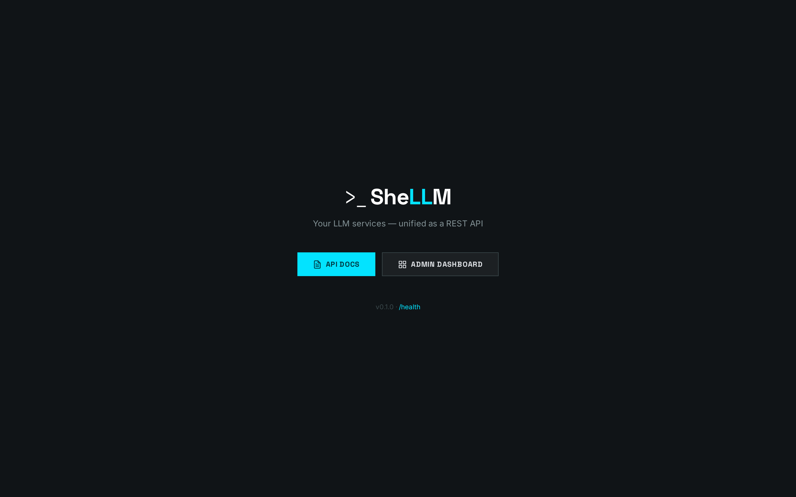
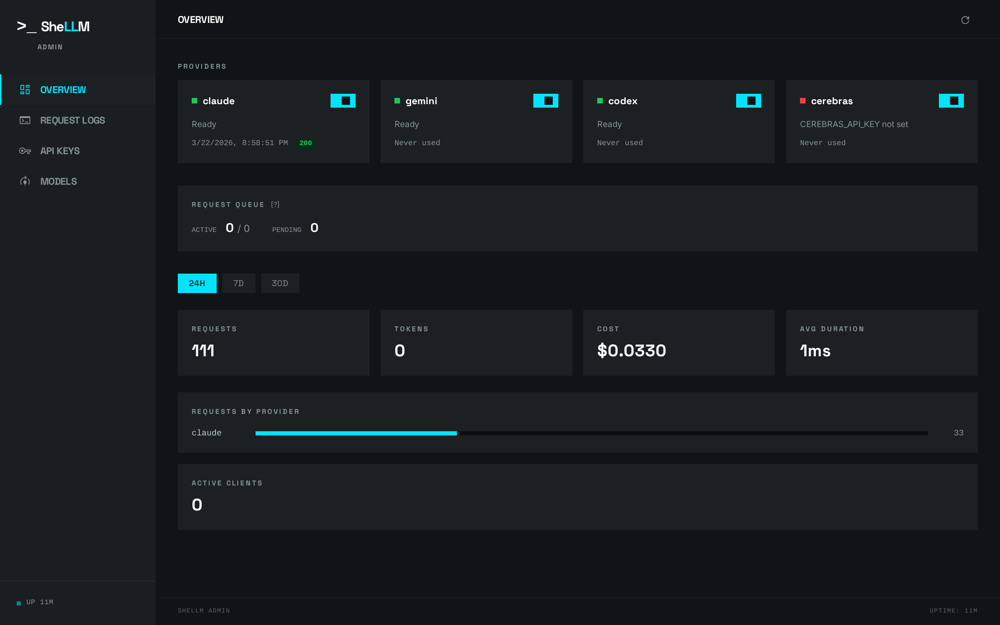
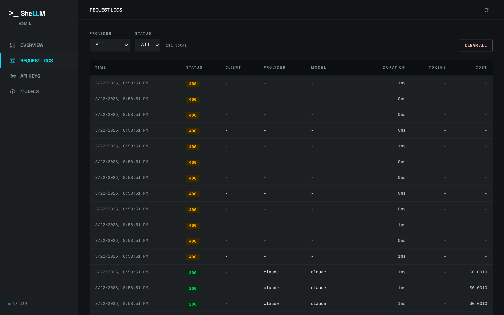

<p align="center">
  <picture>
    <source media="(prefers-color-scheme: dark)" srcset="assets/logo/logo-dark.svg">
    <source media="(prefers-color-scheme: light)" srcset="assets/logo/logo-light.svg">
    
  </picture>
</p>

<p align="center"><em>Your LLM services — unified as a REST API.</em></p>

<p align="center">
  <a href="https://github.com/rodacato/SheLLM/actions/workflows/ci.yml"></a>
  <a href="https://github.com/rodacato/SheLLM/releases/latest"></a>
  <a href="LICENSE"></a>
  <a href="https://nodejs.org">= 22"></a>
</p>

SheLLM turns CLI subscriptions (Claude Max, Gemini AI Plus, OpenAI Enterprise) and API providers (Cerebras) into a single HTTP endpoint. One interface, any provider.

## Why SheLLM

Most LLM gateways assume you're paying per-token via API. SheLLM's primary use case is the opposite: **you already have CLI subscriptions** (Claude Max, Gemini AI Plus, OpenAI Enterprise) and want to expose them as a regular HTTP API to your apps — without burning API quota.

| | SheLLM | LiteLLM | OpenRouter | Portkey |
|---|:---:|:---:|:---:|:---:|
| CLI subscriptions as backends | ✅ | ❌ | ❌ | ❌ |
| OpenAI-compatible endpoint | ✅ | ✅ | ✅ | ✅ |
| Anthropic-compatible endpoint | ✅ | ❌ | ❌ | ❌ |
| Built-in admin dashboard | ✅ | Partial | ❌ | ✅ |
| Self-hosted, no external deps | ✅ | ✅ | ❌ | ✅ |
| SQLite — no Redis / Postgres | ✅ | ❌ | — | ❌ |

[ollama](https://ollama.com) and [Jan](https://jan.ai) are complementary, not competing — they run local models; SheLLM routes to hosted CLI subscriptions and APIs.

## Screenshots

<p align="center">
  
</p>

<p align="center">
  
</p>

<p align="center">
  
</p>

## Quick Start

```bash
git clone git@github.com:rodacato/SheLLM.git && cd SheLLM
bash scripts/setup-dev.sh   # install deps, create .env, link CLI, show auth steps
npm run check:env            # verify binaries, config, and node_modules
shellm start
```

Verify it's running:

```bash
curl http://127.0.0.1:6100/health
```

## Usage

SheLLM exposes two chat endpoints — **OpenAI format** and **Anthropic format**. Both route to the same providers; use whichever matches your SDK.

### OpenAI format

```bash
curl http://localhost:6100/v1/chat/completions \
  -H "Content-Type: application/json" \
  -d '{
    "model": "claude",
    "messages": [{"role": "user", "content": "Explain quicksort in one paragraph"}]
  }'
```

Response:

```json
{
  "id": "shellm-abc123",
  "object": "chat.completion",
  "model": "claude",
  "choices": [{ "index": 0, "message": { "role": "assistant", "content": "Quicksort is..." }, "finish_reason": "stop" }],
  "usage": { "prompt_tokens": 10, "completion_tokens": 50, "total_tokens": 60 }
}
```

### Anthropic format

```bash
curl http://localhost:6100/v1/messages \
  -H "Content-Type: application/json" \
  -d '{
    "model": "claude",
    "max_tokens": 1024,
    "messages": [{"role": "user", "content": "Explain quicksort in one paragraph"}]
  }'
```

Response:

```json
{
  "id": "msg_shellm-abc123",
  "type": "message",
  "role": "assistant",
  "content": [{ "type": "text", "text": "Quicksort is..." }],
  "model": "claude",
  "stop_reason": "end_turn",
  "usage": { "input_tokens": 10, "output_tokens": 50 }
}
```

## Supported Providers

| Provider | Type | Models |
|---|---|---|
| Claude Code | CLI | `claude`, `claude-sonnet`, `claude-haiku`, `claude-opus` |
| Gemini CLI | CLI | `gemini`, `gemini-pro`, `gemini-flash` |
| Codex CLI | CLI | `codex` |
| Cerebras | API | `cerebras`, `cerebras-8b`, `cerebras-120b`, `cerebras-qwen` |

See [CONTRIBUTING.md](CONTRIBUTING.md#adding-a-new-provider) to add your own.

## API

### POST /v1/chat/completions (OpenAI format)

| Field | Type | Required | Description |
|---|---|---|---|
| `model` | string | Yes | Provider or model alias |
| `messages` | array | Yes | Array of `{ role, content }` objects |
| `system` | — | — | Use `role: "system"` in messages array |
| `max_tokens` | integer | No | Max output tokens (1–128000) |

### POST /v1/messages (Anthropic format)

| Field | Type | Required | Description |
|---|---|---|---|
| `model` | string | Yes | Provider or model alias |
| `max_tokens` | integer | Yes | Max output tokens (1–128000) |
| `messages` | array | Yes | Array of `{ role, content }` — content can be string or `[{ type: "text", text }]` |
| `system` | string | No | Top-level system prompt |

### GET /v1/models

Lists available models. Returns OpenAI model list format.

### GET /health

Returns provider status, queue stats, and uptime. No auth required.

### Errors

Both endpoints return errors in their respective format:

**OpenAI** (`/v1/chat/completions`):
```json
{ "error": { "message": "...", "type": "invalid_request_error", "code": "invalid_request", "param": null } }
```

**Anthropic** (`/v1/messages`):
```json
{ "type": "error", "error": { "type": "invalid_request_error", "message": "..." } }
```

| Status | Code | Meaning |
|---|---|---|
| 400 | `invalid_request` | Bad input |
| 401 | `auth_required` | Missing or invalid token |
| 429 | `rate_limited` | Too many requests (includes `Retry-After` header) |
| 502 | `cli_failed` | CLI exited with error |
| 503 | `provider_unavailable` | Provider not configured |
| 504 | `timeout` | Process killed after deadline |

## Authentication

Create keys via the admin API or dashboard:

```bash
# Set admin password
export SHELLM_ADMIN_PASSWORD=your-admin-password

# Create a key
curl -u admin:your-admin-password http://localhost:6100/admin/keys \
  -d '{"name": "my-app", "rpm": 10}'
```

Then use the returned key:

```bash
curl -H "Authorization: Bearer shellm-abc123..." http://localhost:6100/v1/chat/completions ...
```

When no API keys exist, auth is disabled (all requests allowed). See [.env.example](.env.example) for all options.

## Admin Dashboard

Browser-based dashboard at `/admin/dashboard/` (requires `SHELLM_ADMIN_PASSWORD`):

- **Overview** — Provider health, queue stats, request metrics
- **Request Logs** — Filterable table with pagination
- **API Keys** — Create, rotate, revoke keys
- **Models** — Available models by provider

## CLI

```
shellm start [-d] [-p PORT]   Start server (foreground or daemon)
shellm stop                    Stop daemon
shellm restart                 Restart daemon
shellm status                  Show PID and health
shellm logs [-f] [-n N]        View daemon logs
shellm version                 Show version
```

## Deployment

SheLLM runs on a VPS with systemd and cloudflared. See the full deployment guide:

```bash
# On the VPS as root
bash scripts/setup-vps.sh
```

This creates a `shellmer` user, installs Node.js 22, CLI tools, configures systemd, and sets up cloudflared. After setup, authenticate each CLI and start the service:

```bash
sudo -iu shellmer
claude auth login && gemini auth login && codex auth login
exit
sudo systemctl start shellm
```

## Contributing

See [CONTRIBUTING.md](CONTRIBUTING.md) for development setup, code conventions, testing, and how to add providers.

## Changelog

See [CHANGELOG.md](CHANGELOG.md) for release history.

## License

[MIT](LICENSE)
