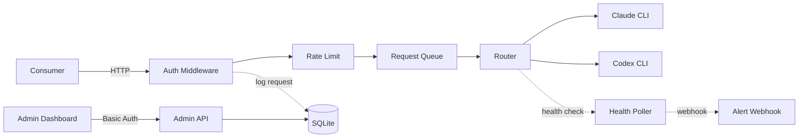

<p align="center">
  <picture>
    <source media="(prefers-color-scheme: dark)" srcset="assets/logo/logo-dark.svg">
    <source media="(prefers-color-scheme: light)" srcset="assets/logo/logo-light.svg">
    
  </picture>
</p>

<p align="center"><em>Your LLM services — unified as a REST API.</em></p>

<p align="center">
  <a href="https://github.com/rodacato/SheLLM/actions/workflows/ci.yml"></a>
  <a href="https://github.com/rodacato/SheLLM/releases/latest"></a>
  <a href="LICENSE"></a>
  <a href="https://nodejs.org">= 24"></a>
</p>

SheLLM turns the CLI subscriptions you already pay for (Claude Max, ChatGPT/Codex) into a single HTTP endpoint that speaks both the OpenAI and the Anthropic wire formats.

## Why SheLLM

Most LLM gateways assume you're paying per-token via API. SheLLM's primary use case is the opposite: **you already pay for a CLI subscription** and want to use it from your own apps through a regular HTTP API, without buying API credit on top.

| | SheLLM | LiteLLM | OpenRouter | Portkey |
|---|:---:|:---:|:---:|:---:|
| CLI subscriptions as backends | ✅ | ❌ | ❌ | ❌ |
| OpenAI-compatible endpoint | ✅ | ✅ | ✅ | ✅ |
| Anthropic-compatible endpoint | ✅ | ❌ | ❌ | ❌ |
| Built-in admin dashboard | ✅ | Partial | ❌ | ✅ |
| Self-hosted, no external deps | ✅ | ✅ | ❌ | ✅ |
| SQLite — no Redis / Postgres | ✅ | ❌ | — | ❌ |

[ollama](https://ollama.com) and [Jan](https://jan.ai) are complementary, not competing — they run local models; SheLLM routes to hosted CLI subscriptions and APIs.

## Fair use and provider terms

SheLLM runs the **official, unmodified CLI binaries** and nothing else. It never extracts OAuth
tokens, never calls a provider's API with subscription credentials, and never pretends to be a
different client. If a change would make SheLLM faster by leaving the official binary, the answer
is no.

It is built for **one person serving their own applications with their own subscription**. It is
not a way to share a subscription, resell capacity, or give a team one login — those break every
provider's terms, and they are the behaviour that gets accounts suspended.

Running your own subscription through your own software still carries risk, and it is yours:

| Provider | Status |
|---|---|
| **Claude** (Claude Code) | Supported. Anthropic's terms forbid intermediating Claude.ai credentials; SheLLM spawns the official binary, which keeps its own login. |
| **Codex** (ChatGPT Plus/Pro/Business) | Supported, at your own risk. OpenAI documents `codex exec` for scripts and CI but recommends API keys for automation. No terms clause forbids wrapping your own subscription; anti-abuse classifiers are the real exposure, and a suspension takes the whole ChatGPT account with it. |
| **Gemini** | Not supported. Gemini CLI stopped serving personal plans on 2026-06-18, and Antigravity's terms forbid "using the Service in connection with products not provided by us". |

Keep it human-scale. SheLLM never retries a request on its own, caps concurrent CLI processes
(`MAX_CONCURRENT`, default 2) and probes provider health with `--version`, which spends no quota.
Cross-provider fallback is off unless you turn it on. What is left to you: one login per provider,
and not pointing a batch job at it. If you need machine-scale volume, buy API access — that is
what it is for.

## Getting Started

### Local development

```bash
git clone git@github.com:rodacato/SheLLM.git && cd SheLLM
npm install && npm link    # dependencies and the shellm command
shellm init                # config file, Claude token, first API key, checks
shellm start
```

`shellm init` asks for the token from `claude setup-token`; skip it if `claude` is already logged in
for your user. `shellm doctor` re-runs the checks at any time, and `shellm doctor --live` sends one
real request.

Verify it's running:

```bash
curl http://127.0.0.1:6100/health
```

Open the admin dashboard at `http://localhost:6100/admin/dashboard/` (requires `SHELLM_ADMIN_PASSWORD` in `.env`). Go to the **Playground** tab to send your first prompt interactively.

### Deploy to a VPS

For production deployment with systemd and cloudflared (zero-trust tunnel, no open ports), see the **[VPS Deployment Guide](docs/guides/deployment.md)**. It covers:

- Full server provisioning (`scripts/setup/vps.sh`)
- CLI authentication on headless servers
- Database migrations and seed data
- cloudflared tunnel setup with your custom domain
- Production hardening (Cloudflare Access, firewall, monitoring)

## Usage

SheLLM exposes two chat endpoints — **OpenAI format** and **Anthropic format**. Both route to the same providers; use whichever matches your SDK.

### OpenAI format

```bash
curl http://localhost:6100/v1/chat/completions \
  -H "Content-Type: application/json" \
  -d '{
    "model": "claude",
    "messages": [{"role": "user", "content": "Explain quicksort in one paragraph"}]
  }'
```

Response:

```json
{
  "id": "shellm-abc123",
  "object": "chat.completion",
  "model": "claude",
  "choices": [{ "index": 0, "message": { "role": "assistant", "content": "Quicksort is..." }, "finish_reason": "stop" }],
  "usage": { "prompt_tokens": 10, "completion_tokens": 50, "total_tokens": 60 }
}
```

### Anthropic format

```bash
curl http://localhost:6100/v1/messages \
  -H "Content-Type: application/json" \
  -d '{
    "model": "claude",
    "max_tokens": 1024,
    "messages": [{"role": "user", "content": "Explain quicksort in one paragraph"}]
  }'
```

Response:

```json
{
  "id": "msg_shellm-abc123",
  "type": "message",
  "role": "assistant",
  "content": [{ "type": "text", "text": "Quicksort is..." }],
  "model": "claude",
  "stop_reason": "end_turn",
  "usage": { "input_tokens": 10, "output_tokens": 50 }
}
```

## Supported Providers

| Provider | Type | Models |
|---|---|---|
| Claude Code | CLI | `claude` (CLI default), `claude-haiku`, `claude-sonnet`, `claude-opus`, plus any `claude-*` model id the CLI accepts |
| Codex CLI | CLI | `codex`, `codex-mini` |

See [CONTRIBUTING.md](CONTRIBUTING.md#adding-a-new-provider) to add your own.

## Architecture


```mermaid
graph LR
    Consumer -->|HTTP| Auth[Auth Middleware]
    Auth --> RateLimit[Rate Limit]
    RateLimit --> Queue[Request Queue]
    Queue --> Router
    Router --> Claude[Claude CLI]
    Router --> Codex[Codex CLI]
    Router -.->|health check| Health[Health Poller]

    Admin[Admin Dashboard] -->|Basic Auth| AdminAPI[Admin API]
    AdminAPI --> SQLite[(SQLite)]
    Auth -.->|log request| SQLite
    Health -.->|webhook| Alert[Alert Webhook]
```

## API

### POST /v1/chat/completions (OpenAI format)

| Field | Type | Required | Description |
|---|---|---|---|
| `model` | string | Yes | Provider or model alias |
| `messages` | array | Yes | Array of `{ role, content }` objects |
| `system` | — | — | Use `role: "system"` in messages array |
| `max_tokens` | integer | No | Max output tokens (1–128000) |

### POST /v1/messages (Anthropic format)

| Field | Type | Required | Description |
|---|---|---|---|
| `model` | string | Yes | Provider or model alias |
| `max_tokens` | integer | Yes | Max output tokens (1–128000) |
| `messages` | array | Yes | Array of `{ role, content }` — content can be string or `[{ type: "text", text }]` |
| `system` | string | No | Top-level system prompt |

### GET /v1/models

Lists available models. Returns OpenAI model list format.

### GET /health

Returns provider status, queue stats, and uptime. No auth required.

### Errors

Both endpoints return errors in their respective format:

**OpenAI** (`/v1/chat/completions`):
```json
{ "error": { "message": "...", "type": "invalid_request_error", "code": "invalid_request", "param": null } }
```

**Anthropic** (`/v1/messages`):
```json
{ "type": "error", "error": { "type": "invalid_request_error", "message": "..." } }
```

| Status | Code | Meaning |
|---|---|---|
| 400 | `invalid_request` | Bad input |
| 401 | `auth_required` | Missing or invalid token |
| 429 | `rate_limited` | Too many requests (includes `Retry-After` header) |
| 502 | `cli_failed` | CLI exited with error |
| 503 | `provider_unavailable` | Provider not configured |
| 504 | `timeout` | Process killed after deadline |

## Authentication

Create keys via the admin API or dashboard:

```bash
# Set admin password
export SHELLM_ADMIN_PASSWORD=your-admin-password

# Create a key
curl -u admin:your-admin-password http://localhost:6100/admin/keys \
  -d '{"name": "my-app", "rpm": 10}'
```

Then use the returned key:

```bash
curl -H "Authorization: Bearer shellm-abc123..." http://localhost:6100/v1/chat/completions ...
```

When no API keys exist, auth is disabled (all requests allowed). See [.env.example](.env.example) for all options.

## Admin Dashboard

Browser-based dashboard at `/admin/dashboard/` (requires `SHELLM_ADMIN_PASSWORD`):

- **Overview** — Provider health, sparklines, cost burn rate, request metrics
- **Playground** — Interactive console to test prompts with any provider/model
- **Terminal** — Live streaming log feed in real time
- **Request Logs** — Filterable table with stats summary and pagination
- **API Keys** — Create, rotate, disable, and revoke keys with audit log
- **Models** — Provider status cards with enable/disable toggle and model registry

## CLI

```
shellm start [-d] [-p PORT]   Start server (foreground or daemon)
shellm stop                    Stop daemon
shellm restart                 Restart daemon
shellm status                  Show PID and health
shellm logs [-f] [-n N]        View daemon logs
shellm version                 Show version
```

## Deployment

SheLLM runs on a VPS with systemd and cloudflared — no open ports, TLS handled by Cloudflare.

```bash
# On the VPS as root
bash scripts/setup/vps.sh
```

See the complete **[VPS Deployment Guide](docs/guides/deployment.md)** for the full walkthrough — from provisioning to your first Playground prompt.

## Contributing

See [CONTRIBUTING.md](CONTRIBUTING.md) for development setup, code conventions, testing, and how to add providers.

## Changelog

See [CHANGELOG.md](CHANGELOG.md) for release history.

## License

[MIT](LICENSE)
