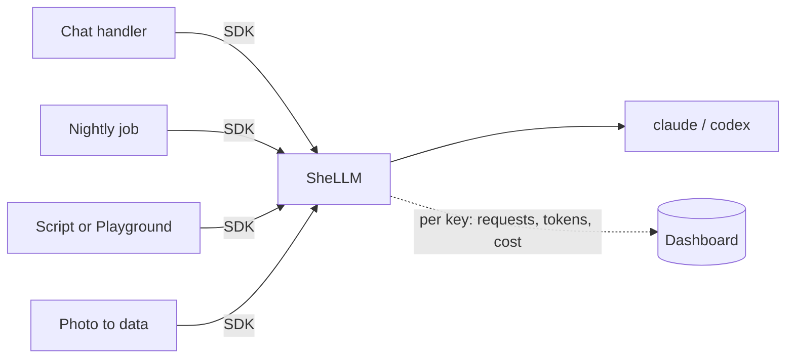
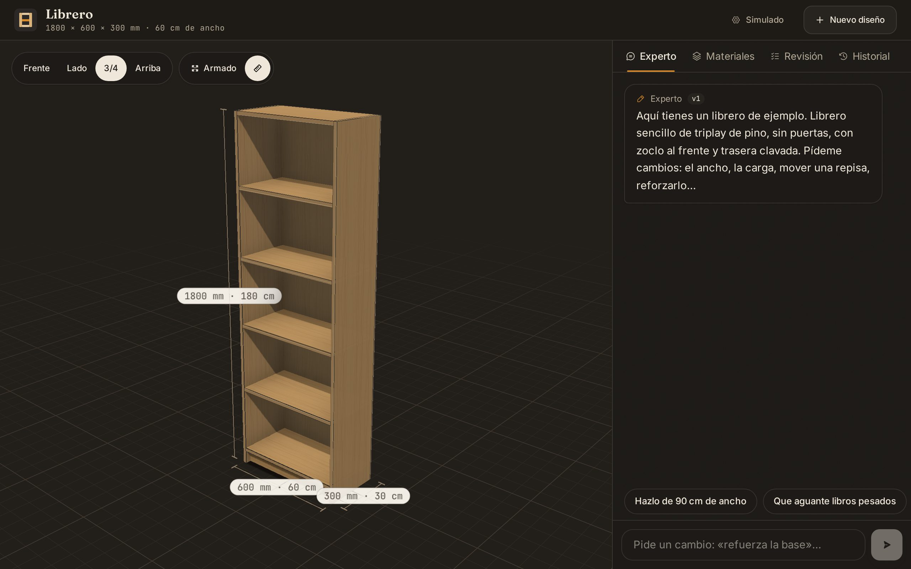
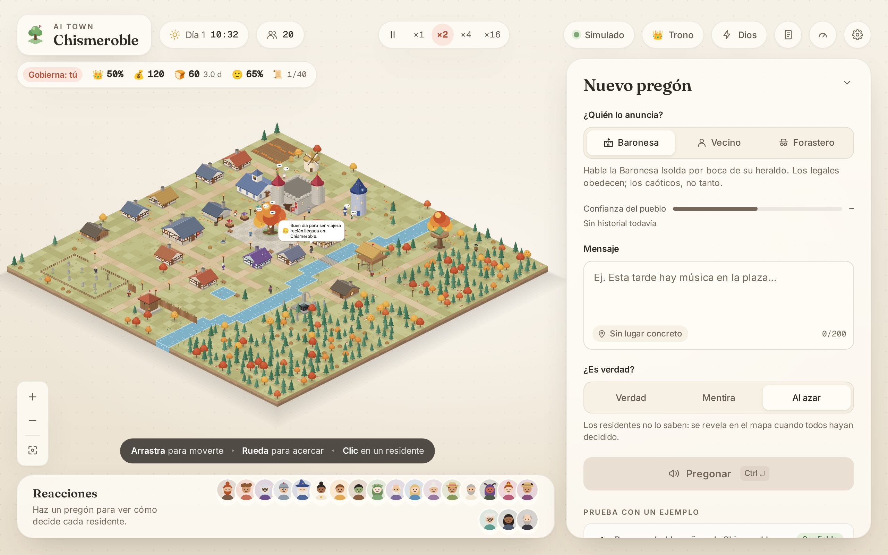
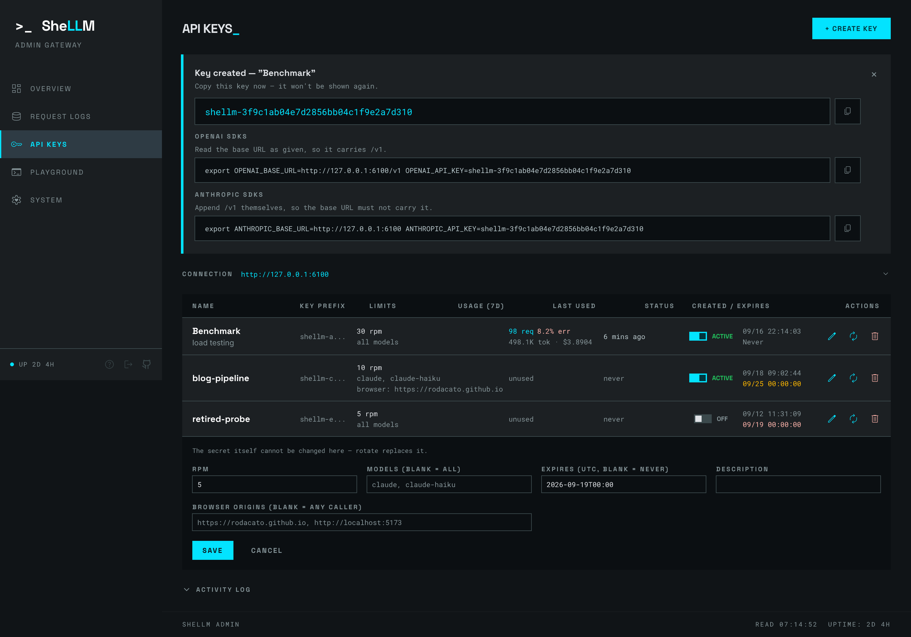

<p align="center">
  <picture>
    <source media="(prefers-color-scheme: dark)" srcset="assets/logo/logo-dark.svg">
    <source media="(prefers-color-scheme: light)" srcset="assets/logo/logo-light.svg">
    
  </picture>
</p>

<p align="center"><em>Your LLM subscription — as a REST API for your own apps.</em></p>

<p align="center">
  <a href="https://github.com/rodacato/SheLLM/actions/workflows/ci.yml"></a>
  <a href="https://github.com/rodacato/SheLLM/releases/latest"></a>
  <a href="LICENSE"></a>
</p>

<p align="center">
  <a href="https://rodacato.github.io/SheLLM/api/">API reference</a> ·
  <a href="docs/guides/usage.md">Calling it from your code</a> ·
  <a href="docs/guides/deployment.md">Running it on a server</a>
</p>

You pay for Claude Code or Codex. Your own apps cannot use that subscription — they need API
credit you would buy separately. SheLLM runs the official CLI you already have, behind one HTTP
endpoint that answers in both the OpenAI and the Anthropic formats, so an official SDK pointed at
it works on the first try.

## What it is not

- **Not a way to share a subscription.** One owner, their own applications. No multi-tenant mode,
  no reselling capacity.
- **Not a backend for coding agents.** Claude Code, Cline, Aider and friends drive their own CLI;
  putting SheLLM in between adds latency and breaks their terms. Use it from software you wrote.
- **Not an API-key gateway.** If you pay per token, LiteLLM and OpenRouter do that better.
- **Not machine-scale.** Subscription quota is measured in human sessions, not throughput.

It does not work with Gemini (see below), with local runtimes like Ollama, or with any provider
that has no official CLI you can log into.

## Fair use and provider terms

SheLLM runs the **official, unmodified CLI binaries** and nothing else. It never extracts OAuth
tokens, never calls a provider's API with subscription credentials, and never pretends to be a
different client. If a change would make SheLLM faster by leaving the official binary, the answer
is no.

Running your own subscription through your own software still carries risk, and it is yours:

| Provider | Status |
|---|---|
| **Claude** (Claude Code) | Supported. Anthropic's terms forbid intermediating Claude.ai credentials; SheLLM spawns the official binary, which keeps its own login. |
| **Codex** (ChatGPT Plus/Pro/Business) | Supported, at your own risk. OpenAI documents `codex exec` for scripts and CI but recommends API keys for automation. No terms clause forbids wrapping your own subscription; anti-abuse classifiers are the real exposure, and a suspension takes the whole ChatGPT account with it. |
| **Gemini** | Not supported. Gemini CLI stopped serving personal plans on 2026-06-18, and Antigravity's terms forbid "using the Service in connection with products not provided by us". |

Keep it human-scale. SheLLM never retries a request on its own, caps concurrent CLI processes
(`MAX_CONCURRENT`, default 4) and probes provider health with `claude auth status` and
`codex login status`, which spend no quota.
Cross-provider fallback is off unless you turn it on. What is left to you: one login per provider,
and not pointing a batch job at it. If you need machine-scale volume, buy API access — that is
what it is for.

## What you'd build with it

You already pay the subscription, so the marginal request costs nothing extra — and for Claude the
CLI reports what that request *would* have cost on the API, attributed to the key that made it.
Build the feature, run it for a week, and you know the bill before you decide to pay one. Codex
reports no cost, so its requests read `not priced`.

Four shapes, one integration — an official SDK with the base URL and the key swapped:


```mermaid
graph LR
    A[Chat handler] -->|SDK| S
    B[Nightly job] -->|SDK| S
    C[Script or Playground] -->|SDK| S
    E[Photo to data] -->|SDK| S
    S[SheLLM] --> CLI[claude / codex]
    S -.->|per key: requests, tokens, cost| D[(Dashboard)]
```

**A chatbot or an assistant inside your app.** Someone is waiting, so latency is the constraint:
the floor for any answer is about 2.5 s ([benchmarks](docs/guides/benchmarks.md)) and four requests
run at a time by default. Fine for one person talking to your app; not a support queue.

**A nightly report over your own data.** A cron job that reads yesterday's rows and leaves a
summary you find in the morning. **One report, not one per row** — pushing a backlog through a
subscription is what gets accounts flagged, and it is the same boundary as "not machine-scale"
above.

**Trying a prompt or a model before it becomes a feature.** The playground sends a real request
down the same path your app takes, and the same key then works from a shell script. Give each
experiment its own key and the dashboard answers which of them is worth paying for.

**Turning photos into structured data.** Send the photos as `data:` URL images with a
`response_format` JSON Schema, and the answer is JSON that matches it — streamed as it is written,
if you ask. [Knotty](https://github.com/rodacato/knotty) does this from a static page: photos of a
piece of furniture in, a parametric plywood design out. Resize in the client first; Claude scales
anything past about 1568 px down anyway, so a bigger photo only costs upload time.

## Built on it

| [Knotty](https://rodacato.github.io/knotty/) | [AI Town](https://rodacato.github.io/ai-town/) |
|---|---|
| [](https://rodacato.github.io/knotty/) | [](https://rodacato.github.io/ai-town/) |
| Photos of a piece of furniture in, a plywood design out, then adjusted by talking to a carpenter. Images and a JSON Schema answer, straight from the browser. | Twenty villagers hear a proclamation and each decides what to do: the same prompts through any model, to compare decisions, latency, tokens and cost. Either format, many small calls. |

## Getting started

Requires Node.js 24 and a logged-in `claude` (or `codex`) on the same machine.

```bash
git clone https://github.com/rodacato/SheLLM.git && cd SheLLM
npm install && npm link    # dependencies and the shellm command
shellm init                # config file, Claude token, first API key, checks
shellm start
```

`shellm init` asks for the token from `claude setup-token` — press Enter to skip it if `claude` is
already logged in for your user — writes `~/.config/shellm/env` with mode 600, prints your first
API key once, writes the load limits so they are values you can see rather than defaults you have
to read the source for, and runs the checks. `shellm doctor` repeats them later; `shellm doctor --live`
sends one real request.

Then, with the key it printed:

```bash
export SHELLM_KEY=shellm-...   # the key init printed, shown once

curl http://127.0.0.1:6100/v1/chat/completions \
  -H "Authorization: Bearer $SHELLM_KEY" -H "Content-Type: application/json" \
  -d '{"model": "claude-haiku", "messages": [{"role": "user", "content": "Hello"}]}'
```

Official SDKs need no code change:

```bash
export OPENAI_BASE_URL=http://127.0.0.1:6100/v1 OPENAI_API_KEY=$SHELLM_KEY
export ANTHROPIC_BASE_URL=http://127.0.0.1:6100 ANTHROPIC_API_KEY=$SHELLM_KEY
```

Those two lines are on the dashboard's API Keys page with your own address filled in, and with the
key filled in too on the one screen that ever shows it.

For a server, [`docs/guides/deployment.md`](docs/guides/deployment.md) covers
`scripts/setup/vps.sh`, the systemd unit and logging a CLI in on a headless machine. Two commands
matter once it is running: `shellm update` moves the host to the newest published release and
rolls back on its own if the service does not come up, and `shellm backup` writes a consistent
snapshot of the database and the config file for whatever you already use to carry backups off a
host.

To call it from your own code — SDK snippets, what Claude can and cannot do through the API, the
limits you will hit — read [`docs/guides/usage.md`](docs/guides/usage.md).

## The dashboard

`/admin` is where the keys, the request log and provider health live. Browsers sign in at
`/admin/login` — any username unless `SHELLM_ADMIN_USER` is set, with the password `shellm init`
printed; scripts use HTTP Basic with the same `SHELLM_ADMIN_PASSWORD`. Over HTTPS it installs as
an app: its own window and icon, and a warm start. Not an offline dashboard — every number on it
comes from the gateway ([ADR-0007](docs/adr/0007-installed-dashboard-is-a-launcher.md)).


Every request is logged with what it cost and how long the CLI took, so "which app is burning the
subscription" is a question with an answer. Nothing about the prompt is stored or inspected.



A key is shown once and never again, so the page shows it beside the two lines that use it — the
OpenAI base URL carries `/v1`, the Anthropic one must not. The connection row below keeps the base URL
in view and opens onto those same two lines against `$SHELLM_KEY`, which is what a key created
months ago still needs.


The playground sends a real request through the same path an app takes, so a key that works here
works everywhere.

## Models

| Provider | Models |
|---|---|
| Claude | `claude` (the CLI's default), `claude-haiku`, `claude-sonnet`, `claude-opus`, and any other `claude-*` id the CLI accepts, passed through as `--model` |
| Codex | `codex` (the CLI's configured default) and any `codex-<model>` id, passed through as `-m <model>` — for example `codex-gpt-5.6-sol`. The CLI runs `--ephemeral` and `-s read-only`, one process at a time |

A model the CLI rejects comes back as `404 model_not_found`.

## API

| Endpoint | Notes |
|---|---|
| `POST /v1/chat/completions` | OpenAI format. `model` and `messages` required, `max_tokens` optional (1–128000). `response_format` takes `json_schema` for structured output, and user messages take `data:` URL images |
| `POST /v1/messages` | Anthropic format. `model`, `max_tokens` and `messages` required, top-level `system` optional |
| `GET /v1/models` | OpenAI model list of the names that map to a real CLI model |
| `GET /health` | `{ "status": "ok" }`, unauthenticated |
| `/admin/*` | Keys, request logs and provider status — see [The dashboard](#the-dashboard) |

The full contract — request and response schemas, the admin endpoints, streaming — is the
OpenAPI document in [`docs/api/openapi.yaml`](docs/api/openapi.yaml). A running instance serves
the bundled version of it at `/docs/openapi.json`, and `npm run docs:preview` opens it as a page.

Requests to `/v1/*` need `Authorization: Bearer <key>` or `x-api-key`. Errors come back in the
format of the endpoint you called:

| Status | Code | Meaning |
|---|---|---|
| 400 | `invalid_request` | Bad input |
| 401 | `auth_required` | Missing or invalid key |
| 403 | `origin_not_allowed` | The key is scoped to other browser origins |
| 404 | `model_not_found` | The CLI does not know that model |
| 429 | `rate_limited` | Too many requests, with `Retry-After` |
| 502 | `cli_failed` | The CLI exited with an error |
| 503 | `provider_unavailable` | Provider disabled, not authenticated, or circuit open |
| 504 | `timeout` | Killed after `TIMEOUT_MS` |

## Using SheLLM from a browser

A page on another origin — `https://you.github.io`, `http://localhost:5173` — can call `/v1`
directly once you allow its origin. Nothing changes for existing callers: with
`SHELLM_CORS_ORIGINS` unset, SheLLM answers exactly as it did before.

```bash
SHELLM_CORS_ORIGINS=https://you.github.io,http://localhost:5173
```

Exact match, one entry per origin — scheme, host and port, no path and no trailing slash. There is
no wildcard: `*` matches nothing, because a page you did not mean to allow should fail rather than
inherit access.

The list covers `/v1` only. The admin endpoints never answer a cross-origin request, so no page can
read your keys or your logs.

### Scope the key to the page

A key can carry its own origin list, set when you create it in the dashboard or over the admin API:

```bash
curl -u admin:$PASSWORD -X POST http://127.0.0.1:6100/admin/keys \
  -H 'Content-Type: application/json' \
  -d '{"name":"bench-page","rpm":30,"origins":["https://you.github.io"]}'
```

A request carrying any other `Origin` gets `403 origin_not_allowed`. A key's list narrows
`SHELLM_CORS_ORIGINS`, it never widens it.

**This is a guardrail, not authentication.** `Origin` is set by browsers; anything else holding the
key can send whatever it likes, or nothing at all — a request with no `Origin` is accepted, so
`curl` still works. What the list actually buys you is that a key pasted into the wrong page stops
working, loudly, instead of quietly running up your subscription.

### The key is in the page

Whatever you ship to a browser is public — view-source, devtools, the network tab. Treat a browser
key as published:

- **A dedicated key**, never the one your servers use.
- **A low `rpm`** and a short `expires_at`. A benchmark page needs a few requests a minute.
- **The model list** narrowed to what the page actually calls.
- **Rotate it** when the page changes hands, and after any public demo.

### Six connections, and how to get past them

A browser opens about **six HTTP/1.1 connections per host**. Request seven streams at once and the
seventh does not queue in SheLLM — it waits in the browser, invisible from the server side, which
will quietly ruin a concurrency benchmark.

HTTP/2 lifts that limit, and SheLLM does not serve it: Express 5 on Node's `http2` compat layer
crashes the process on the first HTTP/2 request. Put a proxy in front instead.

```bash
caddy trust                                                   # once, trusts Caddy's local CA
caddy reverse-proxy --from localhost:6443 --to 127.0.0.1:6100
```

The page then talks to `https://localhost:6443` over HTTP/2, and Caddy talks HTTP/1.1 to SheLLM.
Caddy does not buffer SSE, so streaming still arrives token by token. If the proxy is not on the
same machine, set `SHELLM_TRUST_PROXY` (`loopback`, a hop count, or the proxy's address) so the
admin login lockout counts real client IPs rather than the proxy's.

For TLS without a proxy — enough for a plain `fetch`, still HTTP/1.1 and still six connections:

```bash
mkcert -install && mkcert localhost 127.0.0.1                 # a locally trusted certificate
SHELLM_TLS_CERT=./localhost+1.pem
SHELLM_TLS_KEY=./localhost+1-key.pem
```

Chrome needs one more thing for a public `https://` page to reach `127.0.0.1`: it sends a Private
Network Access preflight, and SheLLM answers it for allowed origins. No setting to turn on.

### Reading the numbers back

Every `/v1` response carries what a benchmark needs:

| | Where |
|---|---|
| `x-shellm-queue-ms`, `x-shellm-queue-position` | response headers (a stream reports its position before it starts) |
| `cost_usd`, `queue_ms`, `cli_ms`, `ttft_ms` | the `x_shellm` block in the body, the final stream chunk, or `message_delta` |
| token counts | `usage` — on a stream, send `stream_options: {"include_usage": true}` |

All of them are in `Access-Control-Expose-Headers`, so JavaScript can actually read them.

A request waiting for a free slot flushes its headers immediately and, while streaming, writes SSE
comment lines every few seconds:

```
: queued position=3 waiting_ms=6012
```

Every SSE parser ignores a comment line, so this needs no client change — it is there so you can
tell a queued request from a wedged one, and so intermediaries see traffic.

## CLI

```
shellm init                    Create the config file and a first API key
shellm doctor [--live]         Check the setup; --live sends one real request
shellm start [-d] [-p PORT]    Start the server (foreground or daemon)
shellm stop | restart          Control the daemon
shellm status                  Report whether the server answers
shellm logs [-f] [-n N]        View daemon logs
shellm config [--new]          Show every setting and where its value came from
shellm backup [--dir DIR]      Snapshot the database and config file into one directory
shellm update | version        Update the install, print the version
```

## Configuration

Settings live in `~/.config/shellm/env`, written by `shellm init` with mode 600 and read at
startup. Anything not set there falls back to a default declared in
[`src/config/schema.js`](src/config/schema.js) — the single place a default exists.
[`.env.example`](.env.example) is the full reference list and is **generated** from that schema by
`npm run config:build`, so edit the schema and never the generated file.

`shellm config` prints what is actually in effect and where each value came from:

```
SETTING              VALUE                     SOURCE         SINCE    RELOAD
MAX_CONCURRENT       4                         default        v0.1.0   live
SHELLM_CORS_ORIGINS  https://you.github.io     config file    v1.10.0  live
LOG_LEVEL            debug                     environment    v0.1.0   restart
```

`SOURCE` is `default`, `config file` or `environment`, and a value in the real environment wins
over the file.

`RELOAD` says whether the code re-reads the value while running (`live`) or froze it at startup
(`restart`). **Editing the config file needs a restart either way** — the file is loaded into the
environment once, when the process starts. The distinction is there for changing a value in place,
which nothing does yet, and it is why `PORT` can never be one of them: the socket is already bound.

### Changing a setting

Locally, append it and restart:

```bash
echo 'MAX_CONCURRENT=8' >> ~/.config/shellm/env
shellm restart
```

On a server the file belongs to the service user, and systemd owns the restart:

```bash
sudo -iu shellmer bash -c "echo 'SHELLM_CORS_ORIGINS=https://you.github.io' >> ~/.config/shellm/env"
sudo systemctl restart shellm
```

Look for an existing line before appending — a key written twice is ambiguous:

```bash
sudo -iu shellmer grep -nE '^#? *SHELLM_CORS_ORIGINS=' ~/.config/shellm/env
```

### After an update

A release can add a setting, and a config file written before it will not mention it. `shellm
doctor` says so, and the dashboard's System page shows the same list:

```
! Settings: 1 available and unset: SHELLM_CORS_ORIGINS
      fix: shellm config --new
```

`shellm config --new` prints each one with what it does and a line ready to paste. Re-running
`shellm init` will not add them — it only writes the handful of keys it knows about, and never
touches a key you already have.

A config created by `shellm init` carries `# shellm-config-version:` on its first line, which is
how a fresh install knows it is not missing anything: the settings the release you just installed
introduced were never withheld from you. Only a release that lands *after* your config was written
is reported. A config written before that marker existed is told about the current release's
settings instead, which is what those hosts already saw.

## How it works


```mermaid
graph LR
    App -->|HTTP| Auth[Auth + rate limit]
    Auth --> Queue[Request queue]
    Queue --> Router
    Router --> Claude[claude CLI]
    Router --> Codex[codex CLI]
    Router -.->|auth status| Health[Health poller]
    Auth -.->|request log| SQLite[(SQLite)]
```

Each request spawns a CLI process in its own temporary directory and discards it, so nothing leaks
between requests — about 0.9 s of process startup, inside a floor of roughly 2.5 s for the whole
short answer, measured on a production server in
[`docs/guides/benchmarks.md`](docs/guides/benchmarks.md). SQLite holds keys, request logs and the
audit trail. [`docs/guides/architecture.md`](docs/guides/architecture.md) has the module
map and [`docs/adr/`](docs/adr/) the decisions.

## Contributing

[CONTRIBUTING.md](CONTRIBUTING.md) covers setup, conventions, tests and adding a provider. Release
history is in [CHANGELOG.md](CHANGELOG.md).

Found a security problem? Do not open an issue — report it through
[the private advisory form](https://github.com/rodacato/SheLLM/security/advisories/new).
[SECURITY.md](SECURITY.md) has the scope, the threat model and the disclosure timeline.

## License

[MIT](LICENSE)
