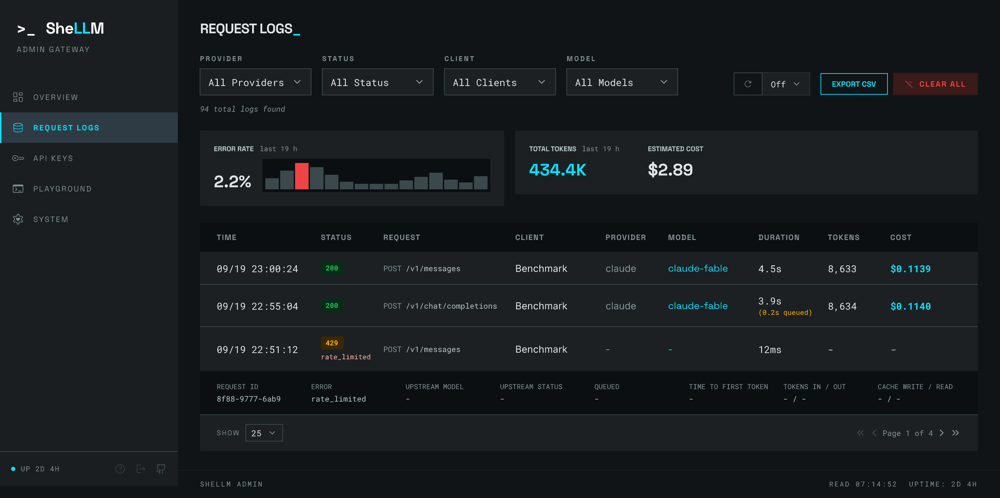
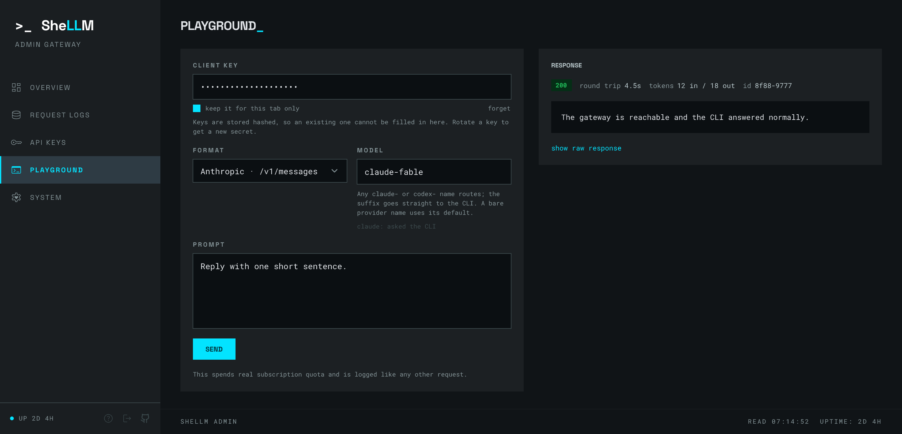
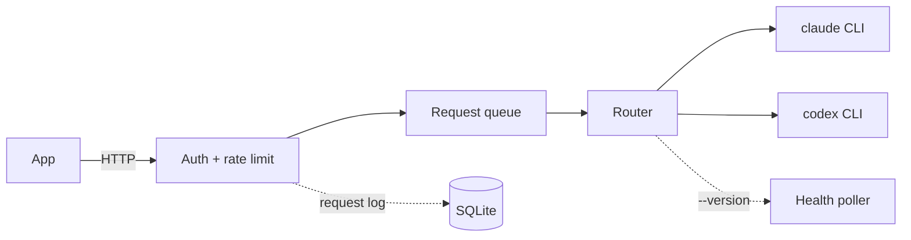

<p align="center">
  <picture>
    <source media="(prefers-color-scheme: dark)" srcset="assets/logo/logo-dark.svg">
    <source media="(prefers-color-scheme: light)" srcset="assets/logo/logo-light.svg">
    
  </picture>
</p>

<p align="center"><em>Your LLM subscription — as a REST API for your own apps.</em></p>

<p align="center">
  <a href="https://github.com/rodacato/SheLLM/actions/workflows/ci.yml"></a>
  <a href="https://github.com/rodacato/SheLLM/releases/latest"></a>
  <a href="LICENSE"></a>
</p>

<p align="center">
  <a href="https://rodacato.github.io/SheLLM/api/">API reference</a> ·
  <a href="docs/guides/usage.md">Calling it from your code</a> ·
  <a href="docs/guides/deployment.md">Running it on a server</a>
</p>

You pay for Claude Code or Codex. Your own apps cannot use that subscription — they need API
credit you would buy separately. SheLLM runs the official CLI you already have, behind one HTTP
endpoint that answers in both the OpenAI and the Anthropic formats, so an official SDK pointed at
it works on the first try.

## What it is not

- **Not a way to share a subscription.** One owner, their own applications. No multi-tenant mode,
  no reselling capacity.
- **Not a backend for coding agents.** Claude Code, Cline, Aider and friends drive their own CLI;
  putting SheLLM in between adds latency and breaks their terms. Use it from software you wrote.
- **Not an API-key gateway.** If you pay per token, LiteLLM and OpenRouter do that better.
- **Not machine-scale.** Subscription quota is measured in human sessions, not throughput.

It does not work with Gemini (see below), with local runtimes like Ollama, or with any provider
that has no official CLI you can log into.

## Fair use and provider terms

SheLLM runs the **official, unmodified CLI binaries** and nothing else. It never extracts OAuth
tokens, never calls a provider's API with subscription credentials, and never pretends to be a
different client. If a change would make SheLLM faster by leaving the official binary, the answer
is no.

Running your own subscription through your own software still carries risk, and it is yours:

| Provider | Status |
|---|---|
| **Claude** (Claude Code) | Supported. Anthropic's terms forbid intermediating Claude.ai credentials; SheLLM spawns the official binary, which keeps its own login. |
| **Codex** (ChatGPT Plus/Pro/Business) | Supported, at your own risk. OpenAI documents `codex exec` for scripts and CI but recommends API keys for automation. No terms clause forbids wrapping your own subscription; anti-abuse classifiers are the real exposure, and a suspension takes the whole ChatGPT account with it. |
| **Gemini** | Not supported. Gemini CLI stopped serving personal plans on 2026-06-18, and Antigravity's terms forbid "using the Service in connection with products not provided by us". |

Keep it human-scale. SheLLM never retries a request on its own, caps concurrent CLI processes
(`MAX_CONCURRENT`, default 2) and probes provider health with `--version`, which spends no quota.
Cross-provider fallback is off unless you turn it on. What is left to you: one login per provider,
and not pointing a batch job at it. If you need machine-scale volume, buy API access — that is
what it is for.

## Getting started

Requires Node.js 24 and a logged-in `claude` (or `codex`) on the same machine.

```bash
git clone git@github.com:rodacato/SheLLM.git && cd SheLLM
npm install && npm link    # dependencies and the shellm command
shellm init                # config file, Claude token, first API key, checks
shellm start
```

`shellm init` asks for the token from `claude setup-token` — press Enter to skip it if `claude` is
already logged in for your user — writes `~/.config/shellm/env` with mode 600, prints your first
API key once, and runs the checks. `shellm doctor` repeats them later; `shellm doctor --live`
sends one real request.

Then, with the key it printed:

```bash
curl http://127.0.0.1:6100/v1/chat/completions \
  -H "Authorization: Bearer $SHELLM_KEY" -H "Content-Type: application/json" \
  -d '{"model": "claude-haiku", "messages": [{"role": "user", "content": "Hello"}]}'
```

Official SDKs need no code change:

```bash
export OPENAI_BASE_URL=http://127.0.0.1:6100/v1 OPENAI_API_KEY=$SHELLM_KEY
export ANTHROPIC_BASE_URL=http://127.0.0.1:6100 ANTHROPIC_API_KEY=$SHELLM_KEY
```

For a server, [`docs/guides/deployment.md`](docs/guides/deployment.md) covers
`scripts/setup/vps.sh`, the systemd unit and logging a CLI in on a headless machine. Two commands
matter once it is running: `shellm update` moves the host to the newest published release and
rolls back on its own if the service does not come up, and `shellm backup` writes a consistent
snapshot of the database and the config file for whatever you already use to carry backups off a
host.

To call it from your own code — SDK snippets, what Claude can and cannot do through the API, the
limits you will hit — read [`docs/guides/usage.md`](docs/guides/usage.md).

## The dashboard

`/admin` is where the keys, the request log and provider health live. Browsers sign in at
`/admin/login`; scripts use HTTP Basic with `SHELLM_ADMIN_PASSWORD`. Over HTTPS it installs as an
app — see [`docs/PWA-AUDIT.md`](docs/PWA-AUDIT.md) for what that install does and does not do.



Every request is logged with what it cost and how long the CLI took, so "which app is burning the
subscription" is a question with an answer. Nothing about the prompt is stored or inspected.



The playground sends a real request through the same path an app takes, so a key that works here
works everywhere.

<sub>Renders from the [design system](design/README.md), which mirrors the shipped code.</sub>

## Models

| Provider | Models |
|---|---|
| Claude | `claude` (the CLI's default), `claude-haiku`, `claude-sonnet`, `claude-opus`, and any other `claude-*` id the CLI accepts, passed through as `--model` |
| Codex | `codex` (the CLI's configured default) and any `codex-<model>` id, passed through as `-m <model>` — for example `codex-gpt-5.6-sol`. The CLI runs `--ephemeral` and `-s read-only`, one process at a time |

A model the CLI rejects comes back as `404 model_not_found`.

## API

| Endpoint | Notes |
|---|---|
| `POST /v1/chat/completions` | OpenAI format. `model` and `messages` required, `max_tokens` optional (1–128000) |
| `POST /v1/messages` | Anthropic format. `model`, `max_tokens` and `messages` required, top-level `system` optional |
| `GET /v1/models` | OpenAI model list of the names that map to a real CLI model |
| `GET /health` | `{ "status": "ok" }`, unauthenticated |
| `/admin/*` | Keys, request logs and provider status — see [The dashboard](#the-dashboard) |

The full contract — request and response schemas, the admin endpoints, streaming — is the
OpenAPI document in [`docs/api/openapi.yaml`](docs/api/openapi.yaml). A running instance serves
the bundled version of it at `/docs/openapi.json`, and `npm run docs:preview` opens it as a page.

Requests to `/v1/*` need `Authorization: Bearer <key>` or `x-api-key`. Errors come back in the
format of the endpoint you called:

| Status | Code | Meaning |
|---|---|---|
| 400 | `invalid_request` | Bad input |
| 401 | `auth_required` | Missing or invalid key |
| 404 | `model_not_found` | The CLI does not know that model |
| 429 | `rate_limited` | Too many requests, with `Retry-After` |
| 502 | `cli_failed` | The CLI exited with an error |
| 503 | `provider_unavailable` | Provider disabled, not authenticated, or circuit open |
| 504 | `timeout` | Killed after `TIMEOUT_MS` |

## CLI

```
shellm init                    Create the config file and a first API key
shellm doctor [--live]         Check the setup; --live sends one real request
shellm start [-d] [-p PORT]    Start the server (foreground or daemon)
shellm stop | restart          Control the daemon
shellm status                  Report whether the server answers
shellm logs [-f] [-n N]        View daemon logs
shellm backup [--dir DIR]      Snapshot the database and config file into one directory
shellm update | version        Update the install, print the version
```

## How it works


```mermaid
graph LR
    App -->|HTTP| Auth[Auth + rate limit]
    Auth --> Queue[Request queue]
    Queue --> Router
    Router --> Claude[claude CLI]
    Router --> Codex[codex CLI]
    Router -.->|--version| Health[Health poller]
    Auth -.->|request log| SQLite[(SQLite)]
```

Each request spawns a CLI process in its own temporary directory and discards it, so nothing leaks
between requests — which costs about 2.5 s before the model starts, measured on a production
server in [`docs/guides/benchmarks.md`](docs/guides/benchmarks.md). Configuration lives in
`~/.config/shellm/env`; SQLite holds keys, request logs and the audit trail. [`docs/guides/architecture.md`](docs/guides/architecture.md) has the module
map and [`docs/adr/`](docs/adr/) the decisions.

## Contributing

[CONTRIBUTING.md](CONTRIBUTING.md) covers setup, conventions, tests and adding a provider. Release
history is in [CHANGELOG.md](CHANGELOG.md).

## License

[MIT](LICENSE)
